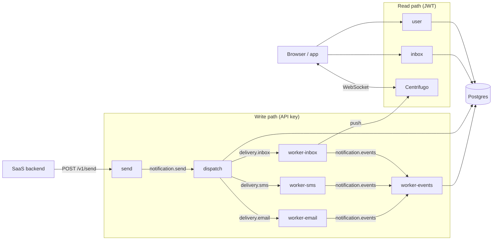

# Hermes Documentation

Hermes is an event-driven, multi-channel notification platform: a Go monorepo of small
services that accept notification requests, fan them out across email / SMS / in-app inbox
channels, and push to users in real time over WebSockets.

## Where do I start?

| If you want to… | Read |
|---|---|
| Send notifications from your backend | [Integration Guide](integration-guide.md) → [API Reference](api/README.md) |
| Understand how Hermes works internally | [Architecture](architecture.md) |
| Run Hermes locally and contribute | [Development](development.md) → [Contributing](../CONTRIBUTING.md) |
| Deploy Hermes on your own cluster | [Self-Hosting](self-hosting/quickstart.md) |
| Deploy the reference AWS/EKS stack | [Deployment Guide](deployment-guide.md) |
| Operate the observability stack | [Observability](observability/README.md) |

## Using Hermes (integrators)

- **[Integration Guide](integration-guide.md)** — end-to-end walkthrough: auth/token exchange,
  creating organizations and API keys, sending notifications, the inbox and user APIs, and real-time push.
- **[API Reference](api/README.md)** — auth modes, the generated OpenAPI/AsyncAPI specs, and how
  to regenerate them.
- **[CLI Reference](cli.md)** — the `hermes` command-line tool for managing resources and an
  interactive inbox viewer.

## Contributing to Hermes (developers)

- **[Contributing](../CONTRIBUTING.md)** — prerequisites, branch/PR conventions, hooks, and CI gates.
- **[Architecture](architecture.md)** — services, the async pipeline, message contracts, and the
  core design patterns.
- **[Architecture Decision Records](adr/README.md)** — the significant architectural decisions and
  their rationale, plus when and how to write a new one.
- **[Reviews](reviews/2026-07-27-architecture-review.md)** — findings from periodic architecture
  and security reviews, kept as a remediation backlog.
- **[Development](development.md)** — local dev with Tilt + k3d (and the lighter Docker Compose
  path for tests), project layout, and live reload.
- **[Testing](testing.md)** — the unit / integration / e2e split and the mock-store pattern.
- **[Data Model](data-model.md)** — the Postgres schema, entities, and the notification status model.
- **[Configuration](configuration.md)** — the `HERMES_*` environment variables the services read.
- **[Glossary](glossary.md)** — domain terms (organization, category, subscription, template, channel…).
- **[Admin Portal](../web/admin/README.md)** — the Next.js admin UI.

## Operating Hermes

- **[Self-Hosting](self-hosting/quickstart.md)** — install via the Helm chart, then
  [configure](self-hosting/configuration.md), [harden for production](self-hosting/production.md),
  and [upgrade](self-hosting/upgrading.md).
- **[Deployment Guide](deployment-guide.md)** — the reference AWS/EKS + Terraform + ArgoCD/Kargo
  deployment.
- **[Observability](observability/README.md)** — the in-cluster LGTM stack, instrumentation,
  dashboards, and alert runbooks.
- **[Load Testing](../loadtest/README.md)** — the k6-based load-testing system.

---

> **Note on `CLAUDE.md`:** the repo's `CLAUDE.md` is guidance for the Claude Code agent, not a
> contributor doc. This `docs/` tree is the source of truth for humans; where the two ever drift,
> trust the code and these docs.
