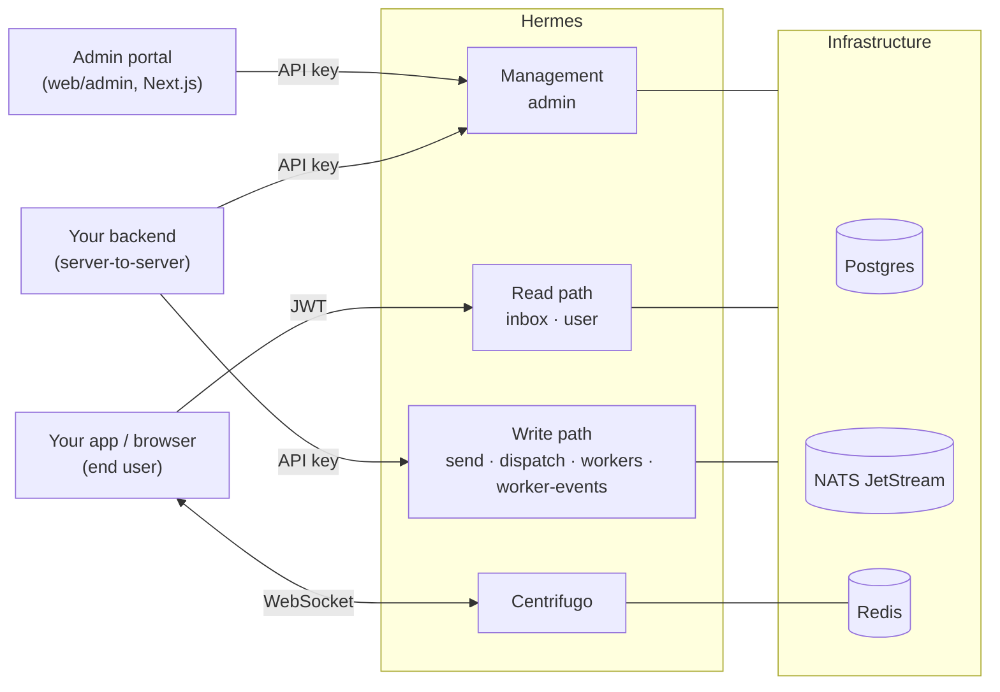
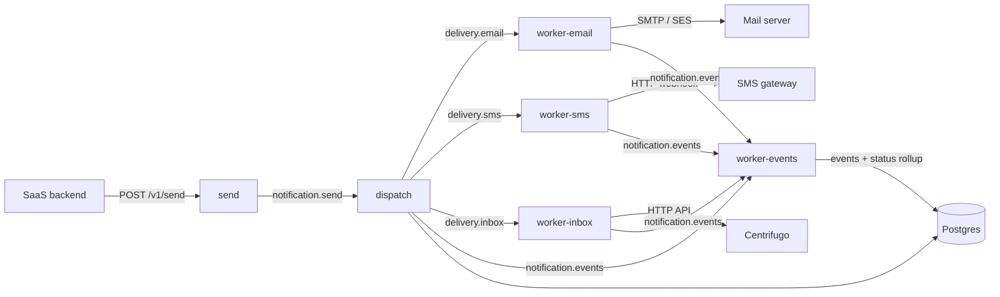
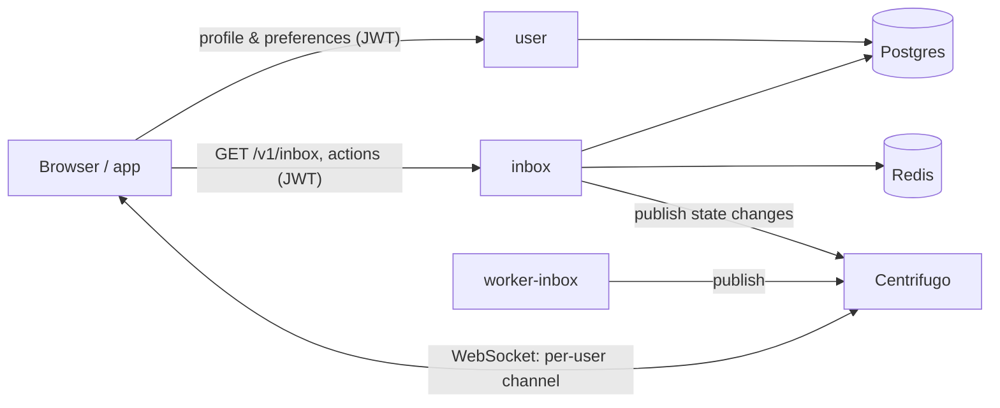
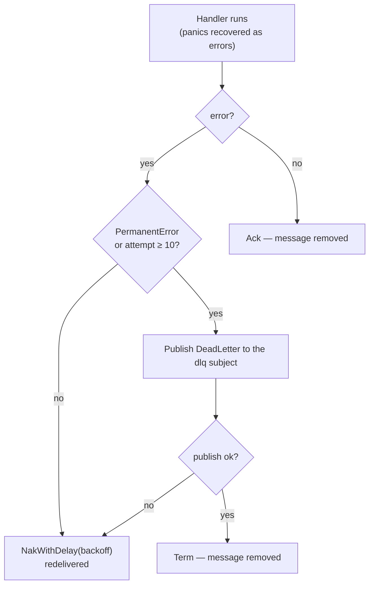
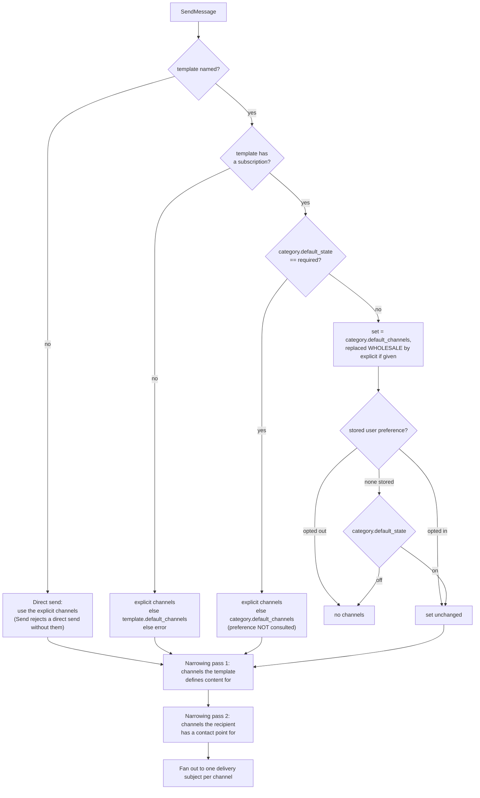
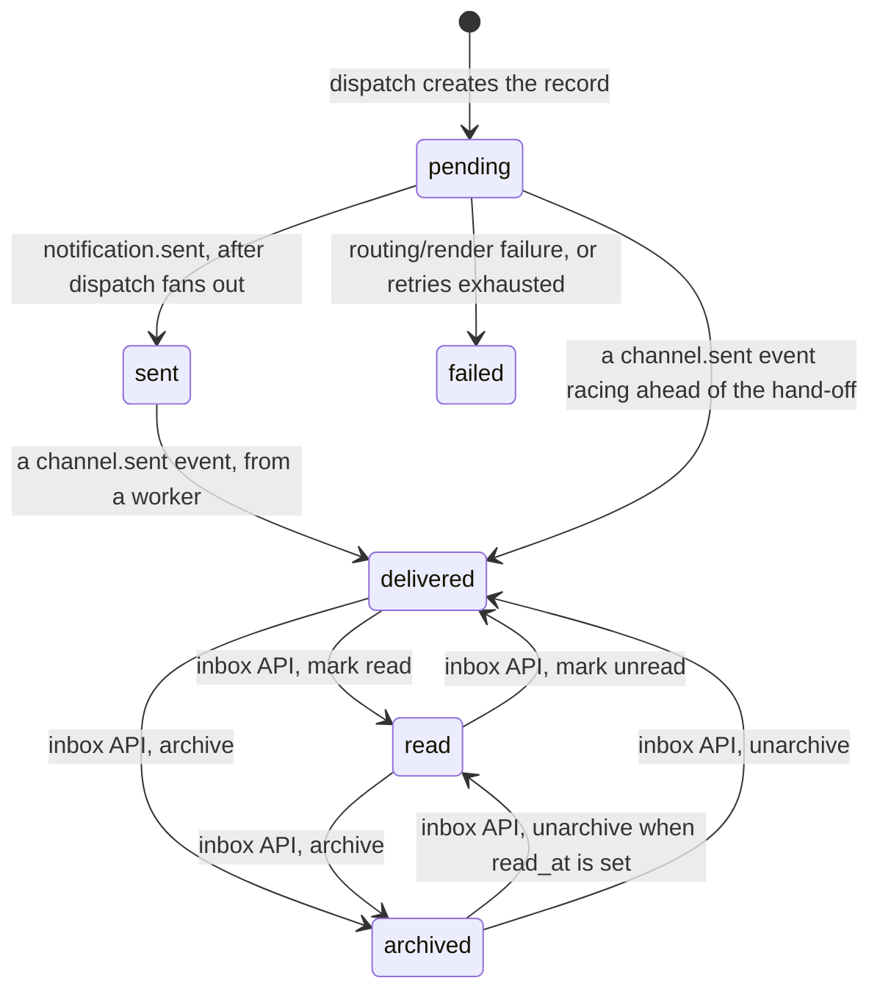

# Architecture

Hermes is a Go monorepo of small, single-purpose services connected by **NATS JetStream**.
A notification enters through a thin ingestion service, moves through an asynchronous pipeline,
and is delivered on one or more channels. Every state change is recorded as an event, and the
notification's rolled-up status is what user-facing read APIs serve.

This document explains how the pieces fit together. For a per-service field reference (ports,
subjects, endpoints) see [services.md](services.md); for the database schema see
[data-model.md](data-model.md).

## System context

Client libraries for the two public surfaces live in `sdks/` (TypeScript, Python, Java, .NET);
the TypeScript workspace additionally ships React and browser packages that wrap the read path
and the Centrifugo subscription.

## The two paths

### Write path (API-key auth)

1. **Send** authenticates the caller's API key, checks it carries `notifications:send`,
   validates the request (exactly one of `template` or `content`; a direct-content send must
   name its `channels`), applies idempotency, and publishes a `SendMessage` to
   `notification.send`. It does no template or channel resolution — it is a thin ingestion
   layer whose job is to get the request onto NATS quickly, and it returns `202 Accepted`
   with the notification ID before any delivery work happens.
2. **Dispatch** consumes `notification.send`. It ensures the organization and user exist,
   persists the notification record (status `pending`) *before* any routing logic so a record
   exists for troubleshooting even if later steps fail, then resolves the template, renders
   content, resolves the channel set, and publishes a `DeliveryMessage` to one
   `delivery.<channel>` subject per surviving channel.
3. **Workers** (`worker-email`, `worker-sms`, `worker-inbox`) each consume their channel's
   subject, perform the delivery, and publish an `EventMessage` to `notification.events`.
4. **worker-events** consumes `notification.events`, batch-inserts rows into
   `notification_events`, and advances the notification's `status`.

Dispatch also emits events of its own — `routing.dispatched` per channel, then a single
`notification.sent` once at least one delivery message reached the bus, plus
`routing.no_channels`, `routing.no_contact`, `delivery.publish_failed` and the failure events
below. So the event log covers routing decisions, not only delivery outcomes, and
`notification.sent` is what advances the notification to the `sent` status.

### Read path (JWT auth)

- **Inbox** serves the user's notification list with cursor-based pagination plus per-item
  actions (read / unread / archive / unarchive / delete, mark-all-read) and an unread count
  cached in Redis. It holds **no NATS client** — it reads the store and pushes state changes
  straight to Centrifugo's HTTP API.
- **User** serves the user's profile and per-subscription notification preferences.
- **Centrifugo** pushes to the browser in real time over WebSockets on a per-user channel
  (`user#<internal-user-id>`). `worker-inbox` publishes new notifications; the Inbox service
  publishes subsequent state changes.

## Services at a glance

| Service | Port | Role | Auth |
|---|---|---|---|
| `send` | 8088 | Ingest `POST /v1/send`, idempotency, publish to NATS | API key |
| `admin` | 8080 | Manage organizations, API keys, categories, subscriptions, templates; issue JWTs | API key |
| `dispatch` | 8081 | Resolve template + channels, fan out to `delivery.*` | internal (NATS) |
| `worker-email` | 8083 | Deliver email (SMTP / SES) | internal (NATS) |
| `worker-sms` | 8084 | Deliver SMS (webhook) | internal (NATS) |
| `worker-inbox` | 8085 | Deliver inbox via Centrifugo push | internal (NATS) |
| `worker-events` | 8082 | Persist events, roll up status | internal (NATS) |
| `inbox` | 8086 | User inbox API | JWT |
| `user` | 8087 | User profile & preferences API | JWT |

Every service binds a single HTTP port from `HERMES_HTTP_PORT`, whose **built-in default is
8080 for all of them**; the distinct ports above are assigned by the local development
environment (see the `Tiltfile` and `docker-compose.yml`) so the nine can run side by side.
Workers expose that port only for `/healthz` and `/readyz` — they take their work from NATS,
not from HTTP. In local k3d, an ingress at `http://localhost:8888` routes to each backend by
path.

CLI/one-shot tools (`migrate`, `natsprovision`, `seed`, `cleanup`, `loadseed`, `openapi`,
`dispatchbench`, `hermes`) are covered in [services.md](services.md) and [cli.md](cli.md).

## Messaging: NATS JetStream

Four streams. The three pipeline streams use **WorkQueue** retention (each message is
delivered to exactly one consumer and removed once acked) with a 7-day `MaxAge`; the DLQ uses
**Limits** retention (7 days / 1 GiB, oldest discarded first) so dead letters survive
inspection reads:

| Stream | Subject(s) | Producer → Consumer |
|---|---|---|
| `NOTIFICATIONS` | `notification.send` | Send → Dispatch |
| `DELIVERY` | `delivery.email`, `delivery.sms`, `delivery.inbox` | Dispatch → Workers |
| `EVENTS` | `notification.events` | Dispatch & Workers → worker-events |
| `DLQ` | `dlq.>` | messaging layer (terminal failures) → operators (nats CLI) |

The DLQ is deliberately absent from the in-process subject→stream table, so nothing in the
codebase can accidentally subscribe to it; operators consume it with the `nats` CLI.

### Streams are provisioned, not self-declared

`cmd/natsprovision` is the only identity that may create or update a stream. It runs as a Job
(the messaging counterpart of `cmd/migrate`), calls `SetupStreams` — idempotent by
construction, so re-running it on every deploy is the intended usage — and exits non-zero on
failure so the Job retries instead of reporting success against a bus with no streams.

Services **verify rather than declare**: each calls `messaging.EnsureStreams` with its own
name at boot and refuses to start if a stream it depends on is missing. The per-service
dependency list is `messaging.StreamsForService`, which is a checked contract with the NATS
account file — an entry without a matching `$JS.API.STREAM.INFO` grant is a service that
cannot boot, and a grant without an entry is an over-grant. Running out of order is therefore
a crash-loop that converges, not a silent misconfiguration. See
[ADR 0005](adr/0005-transport-security-for-infrastructure-connections.md).

### Wire contracts

The contracts are shared Go structs in `internal/nats/` (package `hermenats`,
`internal/nats/messages.go`) and mirrored in the AsyncAPI spec at `api/async/asyncapi.yaml`:

- **`SendMessage`** — notification ID, organization, external user ID, optional `contacts`
  (per-send address overrides: address key → address), optional `content`,
  `metadata.template`, `data` (template render context), `channels`, `idempotency_key`,
  `attempt`.
- **`DeliveryMessage`** — notification ID, organization, resolved `user_id`, the target
  `channel`, the resolved `content`, `metadata`, the resolved `recipient`, `attempt`.
- **`EventMessage`** — notification ID, `channel`, `event` (e.g. `email.sent`, `sms.failed`),
  `severity` (`info`/`warn`/`error` — `warn`, not `warning`), and free-form `metadata`.
  `channel` is empty for events about the whole notification rather than one delivery
  (`notification.sent`, `routing.no_channels`, and the failure events).
- **`DeadLetter`** — terminally failed message envelope: original `subject`, source
  `stream`/`consumer`, `reason` (`max_deliveries`/`terminated`), `attempts`, the handler
  `error`, `failed_at`, and the original `payload` verbatim. `payload` is a **base64 string**,
  not inline JSON — anything reading the DLQ must decode it. See the
  [dead-letter-queue runbook](observability/runbooks/dead-letter-queue.md).

`recipient` and `contacts` are **maps** keyed by a channel's address key (`email`, `phone`, …),
not fixed fields. Dispatch builds `recipient` by starting from the user's stored contact points
and overlaying any non-empty per-send `contacts`. This is what lets a channel be added without
changing the message contract or the schema — see [ADR 0002](adr/0002-provider-plugin-model-bus-native-isolation.md)
and `user_contact_points` in [data-model.md](data-model.md).

### Consumer model

`internal/messaging` gives every consumer the same shape: one fetcher loop pulls from a durable
consumer into a bounded pool of workers over an unbuffered channel, so when all workers are busy
the hand-off blocks and the fetcher stops draining — natural backpressure. `Prefetch`
(`PullMaxMessages`) keeps the pull pipeline full without one consumer hoarding the backlog, and
`MaxAckPending` is raised automatically if it is below `Prefetch + Workers` so the server never
throttles below the in-flight budget.

| Consumer | Durable name | Workers | Prefetch |
|---|---|---|---|
| Dispatch | `dispatch` | `HERMES_DISPATCH_CONCURRENCY` (default 8) | `HERMES_DISPATCH_PREFETCH` (default 64) |
| Delivery workers | `worker-<channel>` | 4 | default (64) |
| Event writer | `event-writer` | 1 (feeds an in-memory batcher that flushes at 100 events or 500 ms) | 256 |

Dispatch's pool is clamped to the Postgres pool size at startup — each worker holds at most one
connection while processing, so more workers than connections only adds contention. The clamp
logs a warning naming `pool_max_conns` rather than silently accepting the requested value.

## Reliability: retries, backoff, and the DLQ

Every consumer runs through the same failure ladder in `internal/messaging`:

- **`MaxDeliver` is 10.** Backoff doubles per attempt (1s, 2s, 4s, …) capped at 240s, then
  jitter picks a uniform delay in `[base/2, base]`.
- **Permanent vs transient is a handler decision.** A handler returning an error that
  implements `PermanentError` is dead-lettered immediately rather than nacked through nine
  pointless redeliveries. Unparseable messages are permanent everywhere. A *provider* failure
  is deliberately treated as transient: `Provider.Send` gives no way to distinguish a 4xx
  rejection from a connection refused, so per-provider classification is future work.
- **A message is never destroyed before it is preserved.** If the dead-letter publish itself
  fails, the message is nacked rather than terminated, and the `HermesDLQPublishFailure` alert
  fires.
- **Failure events are emitted once, on the final attempt.** Publishing `<channel>.failed` on
  every attempt would put up to ten failure events on the stream for one notification, and any
  alert counting them would read a single flaky delivery as a cluster of failures.
- **Dispatch splits its own failures.** Infrastructure failures (DB down) are transient and
  retried, except on the last attempt, where the notification is marked `failed`. Routing and
  rendering failures are permanent, recorded against the notification with a typed event
  (`template.not_found`, `render.failed`, `routing.failed`), and not retried.

**Publishing to `notification.events` is best-effort, by design.** Both dispatch and the
workers publish events fire-and-forget: a failed publish is logged and nothing else. The
durable artifacts are the notification record in Postgres and the delivery messages on the
`DELIVERY` stream; the event log is observability and status rollup layered on top.

The trade is deliberate, because the alternatives are worse. If dispatch propagated an
event-publish failure the handler would either mark the notification `failed` and dead-letter
it (the permanent path) *while its emails are being delivered*, or nack it for redelivery —
and redelivery re-runs the fan-out, so a lost status event would be paid for with duplicate
emails and SMS. Losing a rollup event costs less than either.

The visible consequence: if the `notification.sent` publish fails, the notification stays
`pending` until a worker's `<channel>.sent` moves it to `delivered`, and stays `pending`
if every delivery also fails. In practice the same NATS outage usually takes the delivery
publishes with it, in which case nothing was dispatched and no `notification.sent` is due.
Making the transition durable would need a transactional outbox — worth an ADR, not a patch.

## Key design patterns

**Store interfaces per service.** Each service declares the slice of persistence it needs as its
own interface (e.g. `AdminStore`, `InboxStore`, `UserStore`); the concrete `*store.Store` (over
Postgres) satisfies all of them. Handlers depend on the interface, so unit tests substitute a
mock — see each package's `testutil_test.go` and [testing.md](testing.md).

### Channels and providers

A **channel** is the user-facing medium (`email`, `sms`, `inbox`); a **provider** is the
pluggable delivery unit serving exactly one channel (`smtp`, `ses`, `sms`, `inbox`). Both are
described by `internal/provider`'s registry — a channel descriptor carries its content schema
and its required address key, so channel-specific knowledge lives in registered metadata
rather than in `switch ch` blocks in dispatch. `provider.Builtins` is constructed at package
init and read-only thereafter.

Delivery subjects remain **per channel**, not per provider. The per-provider subject contract
(`delivery.<channel>.<provider>`), per-notification provider routing, and third-party provider
isolation are later phases of [ADR 0002](adr/0002-provider-plugin-model-bus-native-isolation.md);
what ships today is the registry and the de-hardcoded dispatch.

### Channel resolution

Dispatch resolves channels in `internal/dispatch/channels.go`.

**A user's preference cannot select channels.** `user_subscriptions` holds `opted_in` and no
channel column, so a preference is a boolean gate: opting out suppresses the notification
entirely, and opting in accepts whatever set was already resolved. Per-channel preference
granularity is an explicit non-goal of the subscriptions design.

Notes on the diagram:

- The explicit-channel override is a **replacement, not a merge** or a per-channel override.
- A `required` category ignores an opt-out **by design**.
- The two narrowing passes run *after* resolution, not as part of it. The first is skipped for
  direct sends (there is no template to define content). The second consults the channel
  registry: a channel with no address requirement — `inbox` — is always kept, as is a channel
  the registry has never heard of.
- If nothing survives, dispatch emits `routing.no_channels` (and `routing.no_contact` per
  dropped channel) and stops. The notification record stays `pending`; it is not marked failed,
  because nothing failed.

### Notification status

Statuses are ranked in `internal/models/status.go`: `pending`/`failed` = 0, `sent` = 1,
`delivered` = 2, `read` = 3, `archived` = 4.

**The event-driven rollup only advances.** Because events can arrive out of order,
`worker-events` updates status with a rank comparison in the SQL `WHERE` clause (and
deduplicates a batch down to the highest rank per notification first), so a late event can
never pull a notification back. `failed` shares rank 0 with `pending`, which means the rollup
can never *set* it — `failed` is written directly by dispatch, as a terminal outcome rather
than an advancement.

Two things the ranking does not say:

- **Only two events move status.** `notification.sent`, published once by dispatch after the
  fan-out, advances `pending → sent`; `<channel>.sent`, published by a worker, advances to
  `delivered`. Everything else on `notification.events` — `routing.dispatched`,
  `routing.no_channels`, the failure events — is timeline detail with no status effect.
  (`eventToStatus` also lists `<channel>.routed` names that nothing publishes; they are
  vestigial.)
- **A fast delivery skips `sent` in the status column, and that is correct.** The event writer
  flushes every 100 events or 500 ms and collapses each batch to the highest rank per
  notification, so when delivery completes inside one flush window the `notification.sent` and
  `<channel>.sent` events land together and only `delivered` is written. The status column is a
  *furthest-progress* rollup, not a transition log — `delivered` already implies the hand-off
  happened. Nothing is lost: the `notification.sent` row is always in `notification_events`,
  and `sent_at` is stamped either way, because the update sets it for any rank ≥ 1. Expect to
  observe status `sent` when delivery is slower than the flush window, or when no worker is
  consuming the channel; do not build on seeing it for a fast local delivery.
- **The read path deliberately regresses status.** Mark-unread moves `read → delivered` and
  unarchive moves `archived → read`/`delivered`. These are explicit user actions on
  `internal/store/postgres/inbox.go`, not rollup events, and the monotonic rule does not — and
  should not — apply to them.

**Idempotency.** Send dedupes on an idempotency key (scoped per organization, via a Redis
`SET NX` with a one-hour TTL) so retried client requests don't produce duplicate notifications;
the same key is also enforced by a unique partial index on `notifications` (see
[data-model.md](data-model.md)).

**Caching.** Redis fronts hot, slow-changing reads — template/subscription/category config,
API-key lookups, JWT signing keys, and inbox unread counts — and backs Centrifugo's engine and
the idempotency dedup. Caches use short TTLs (5 minutes for subscription and category config)
and fall back to Postgres on a miss.

## Authentication and authorization

**The isolation boundary is the app, not the organization.** An API key authenticates the
*app* — the product integrating Hermes — and is deliberately **not** scoped to an
organization: one app sends on behalf of many organizations, and the same organization may
be served by more than one app, so a key scoped to one would break the core use case. There
is no `app` entity in the schema; one installation (one database) serves exactly one app,
and that deployment separation is the entire enforcement mechanism. Consequently the
`organization_id` on a send request and the `organization_id` JWT claim are routing and
partitioning labels, not authorization scopes. See
[ADR 0003](adr/0003-rename-tenant-to-organization.md).

**API keys** (`internal/auth/apikey.go`). Raw key format is
`hms_[<env>_]key_<id>_<secret>` (env prefix `stg`/`dev`, omitted in production). Only an
HMAC-SHA256 hash of the secret (keyed by `HERMES_API_KEY_HMAC_SECRET`) is stored, in
`api_keys.key_hash`; verification recomputes the HMAC and compares in constant time.

**API keys carry permissions** (`internal/auth/permissions.go`): `notifications:send`,
`templates:manage`, `organizations:manage`, `apikeys:manage`. Authentication is not
authorization — `POST /v1/send` requires `notifications:send` specifically, so a key issued
narrowly for template management cannot forge notifications. A key created without an explicit
permission list gets the first three; `apikeys:manage` has to be asked for. The check fails
**closed**: a request that reaches a handler without a validated key is denied rather than
granted everything.

**JWTs** (`internal/auth/jwt.go`). Tokens are Hermes-issued and HMAC-signed. Each registered
key records its own algorithm and is validated against exactly that algorithm, so a token
signed with a different HMAC variant is rejected even when the secret matches.

The middleware does accept several concurrently valid signing keys from `jwt_signing_keys`,
which is what makes it possible to phase in an externally registered issuer without a flag
day. **Rotating the Hermes-internal key is not, however, something a config change performs.**
That row is written once, on first startup, and is never overwritten afterwards: setting
`HERMES_JWT_SECRET` against a database that already holds it has no effect, and the service
logs a warning at startup saying the configured value is being ignored. This is deliberate —
the variable has a default, and three services (`admin`, `inbox`, `user`) call
`EnsureHermesSigningKey` on boot, so an upsert meant any one of them starting without the
variable set would silently replace a rotated key and invalidate every token issued under it.

Rotating it is therefore an explicit operation against `jwt_signing_keys`, and it must be
coordinated with Centrifugo, which validates the same tokens but accepts exactly one
`token_hmac_secret_key` (see [Integration Guide](integration-guide.md)). Changing
`HERMES_JWT_SECRET` on a *fresh* database is a different matter — there the value is adopted,
because there is no row to conflict with.

The `sub` claim is the internal user ID, and an `organization_id` claim must be present and
resolve to a non-empty value; a claim that is present but not a string or number is rejected
rather than treated as blank. Backends obtain a token by exchanging a user identifier via the
Admin auth endpoint (see [Integration Guide](integration-guide.md)).

`/healthz` and `/readyz` skip auth on every service.

## Transport security and fail-closed startup

Per [ADR 0005](adr/0005-transport-security-for-infrastructure-connections.md), connections to
the infrastructure are authenticated and encrypted, and a service that cannot do so **refuses
to start**. That failure is loud and recoverable; connecting in the clear and continuing to
serve is silent and is not.

- **`HERMES_ENV`** gates the checks. Only the exact value `development` relaxes them, so a
  typo cannot silently disable every check.
- Outside development, `config.Validate` rejects a Postgres URL whose `sslmode` is not
  `require`/`verify-ca`/`verify-full` (`prefer` and `allow` fall back to plaintext without
  telling anyone), a `HERMES_REDIS_URL` that is not `rediss://`, and a `HERMES_NATS_URL` that
  is not `tls://`. It reports *every* problem it finds, not just the first.
- It also rejects any of `HERMES_JWT_SECRET`, `HERMES_API_KEY_HMAC_SECRET`, and
  `HERMES_CENTRIFUGO_API_KEY` still holding its built-in default — those defaults are
  committed to a public repository, so a deployment using one does not have a weak secret, it
  has a published constant.
- The checks read the connection strings themselves rather than separate "TLS enabled"
  settings: two settings that can disagree are worse than one that cannot.

**NATS identity is per service.** Each service connects with its own NKey seed
(`HERMES_NATS_NKEY_SEED`), which selects its user — and therefore its subject and stream
permissions — in the NATS account file. `cmd/natsprovision` uses a different NKey from every
service, so it is the only thing on the bus that can shape a stream. An empty seed means
anonymous, which works only against a server with no accounts (`make infra-up`); a server that
defines accounts answers an unauthenticated connect with an authorization violation, so a
deployment that forgets the seed fails to start rather than running with fewer rights. The
seed file is re-read on every authentication challenge, so a rotated Secret is picked up on
the next reconnect without a restart. `HERMES_NATS_CA_BUNDLE` supplies the roots that verify
the server certificate, which cert-manager signs with a private CA that is in no system trust
store.

## IDs

IDs are generated by `internal/id/v2` (base62, lexicographically sortable). Two pre-configured
generators cover most entities:

- **Notification IDs** — 48-bit millisecond timestamp + 80-bit random → 22 chars, no prefix,
  time-sortable.
- **Prefixed IDs** — a type prefix plus random bits, e.g. `usr_…` (users), `key_…` (API keys).

Organizations are the exception: they use UUIDs. (The older `internal/id` Crockford-Base32 package is
superseded by `internal/id/v2`.)

## Infrastructure

- **Postgres** — one shared database, reached through `internal/store`. Migrations in
  `migrations/` via golang-migrate, applied by a `cmd/migrate` Job. **Required in every
  configuration**, including when the DynamoDB path below is enabled.
- **DynamoDB (optional)** — a second store for the hot notification and event path, enabled
  by setting `HERMES_DYNAMO_ENDPOINT`. See [the dual store](#the-dual-store) below.
- **NATS JetStream** — the four streams above, declared by a `cmd/natsprovision` Job.
- **Redis** — cache, idempotency dedup, and Centrifugo engine.
- **Centrifugo** — real-time WebSocket push on user-scoped channels; NATS broker, Redis engine.

Two Jobs therefore run ahead of the services — schema and streams — and both are idempotent
and crash-loop to convergence. See [ADR 0006](adr/0006-migration-job-as-an-argocd-presync-hook.md)
and [ADR 0008](adr/0008-helm-chart-provisioning-jobs-are-not-hooks.md) for how they are
sequenced in ArgoCD and in the Helm chart.

### The dual store

Setting `HERMES_DYNAMO_ENDPOINT` switches the notification and event path to a DynamoDB-model
store (`internal/store/dynamo`, per [ADR 0001](adr/0001-dynamodb-model-via-extenddb.md)).
Leaving it empty — the default — keeps everything on Postgres. Five services read the
variable: admin, dispatch, inbox, user and worker-events.

**Postgres is still required.** This is a delegation, not a replacement: `dynamo.NewEventStore`
takes the Postgres store as a delegate, and every service calls `MustConnectDB`
unconditionally before consulting the variable. A deployment that provisions DynamoDB and
drops Postgres will not start.

Three consequences worth knowing before enabling it:

- **Cursors are not portable between backends.** Inbox pagination cursors encode
  backend-specific state, so a cursor issued by one store is rejected by the other with
  `invalid cursor`. Switching backends invalidates every cursor a client is holding — see
  [ADR 0001](adr/0001-dynamodb-model-via-extenddb.md) and the note in
  [integration-guide.md](integration-guide.md).
- **Event retention does not run.** `cmd/cleanup` exits immediately when
  `HERMES_DYNAMO_ENDPOINT` is set, so the nightly CronJob reports success while deleting
  nothing. Records are expected to expire by TTL instead, and nothing verifies that they do.
  See [data-model.md](data-model.md#retention).
- **Backup is a separate story.** The Postgres backup guidance in
  [self-hosting/production.md](self-hosting/production.md) does not cover the DynamoDB
  table, and no backup mechanism for it exists in this repository.

## Where to go next

- [services.md](services.md) — exact ports, subjects, and endpoints per service.
- [data-model.md](data-model.md) — the schema and status model.
- [configuration.md](configuration.md) — every `HERMES_*` variable.
- [development.md](development.md) — run it all locally.
- [adr/README.md](adr/README.md) — the decisions behind the above, and why.
- [observability/architecture.md](observability/architecture.md) — telemetry topology.
