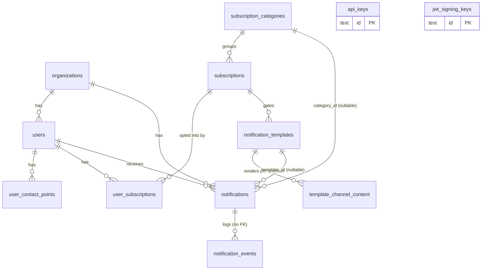

# Data Model

All services share one Postgres database, accessed through `internal/store`. The schema is
managed with [golang-migrate](https://github.com/golang-migrate/migrate): numbered pairs in
`migrations/` (`NNNNNN_<name>.up.sql` / `.down.sql`), applied with `make migrate`.

> This page describes the **current** schema (after all migrations). Some tables were renamed
> along the way — notably the old `notification_groups`/`notification_types`/`user_preferences`
> were replaced by `subscription_categories`/`subscriptions`/`user_subscriptions` plus
> `notification_templates` in migration `000011`. The current names are what the code uses.

## Entities

`api_keys` and `jwt_signing_keys` stand alone — neither references an organization
(see [architecture.md](architecture.md#authentication-and-authorization) for why).

### `organizations`
The isolation boundary. **UUID** primary key (the one entity not using a base62 ID).
Columns: `id`, `name`, `default_locale` (default `en`), `settings` (JSONB), `created_at`.

### `users`
A recipient within an organization. `id` (base62, `usr_…`), `organization_id` → `organizations`, `external_id`
(your application's user identifier), `locale`, `created_at`.
Unique on `(organization_id, external_id)` — each external user maps to exactly one Hermes user
per organization.

> The fixed `email` and `phone` columns were **dropped** in migration `000016`. Addresses now
> live in `user_contact_points`, one row per address key, so a channel can be added without a
> schema change.

### `user_contact_points`
A user's address for one channel. Composite PK `(user_id, address_key)`, plus `address` and
`verified` (bool). `address_key` is the channel's address slug — `email`, `phone` — so adding a
channel adds rows rather than columns. Backfilled from the old `users.email`/`users.phone` in
migration `000015`.

> `verified` is currently **inert**: it is written `false` by the default and never set to
> `true`, never read, and never exposed through the API. It records an intent that is not yet
> implemented — treat a `false` here as "unknown", not "unverified".

### `subscription_categories`
Top-level grouping of notification preferences (e.g. *Account*, *General*, *Marketing*).
`id`, `slug` (unique), `name`, `default_channels` (text[]), `default_state`
(`on` / `off` / `required`), `sort_order`, `created_at`. Three categories are seeded by default.

### `subscriptions`
A specific preference within a category. `id`, `category_id` → `subscription_categories`,
`slug`, `name`, `sort_order`, `created_at`. Unique on `(category_id, slug)`.

### `notification_templates`
Reusable per-channel content. `id`, `subscription_id` → `subscriptions` (nullable), `slug`
(unique), `name`, `default_channels` (text[]), `created_at`.

> The five fixed content columns — `email_subject`, `email_body`, `sms_body`, `inbox_title`,
> `inbox_body` — were **dropped** in migration `000016`. Content moved to
> `template_channel_content` in `000015`, which is why a template can now carry content for a
> channel the schema has never heard of.

### `template_channel_content`
One row of content per template per channel. Composite PK `(template_id, channel_slug)`, plus
`content` (JSONB, default `{}`), cascading on template delete. The JSONB shape is per-channel —
email uses `subject` and `body`, SMS and inbox use their own keys — so a new channel needs no
migration. The `000015` backfill used `jsonb_strip_nulls`, so a template that only ever had a
subject does not carry a null body.

### `user_subscriptions`
A user's opt-in/out for a subscription. Composite PK `(user_id, subscription_id)`, plus
`opted_in` (bool) and `created_at`. Absence means "fall back to the category default state."

### `notifications`
One notification to one user. `id` (base62, time-sortable), `organization_id` → `organizations`,
`user_id` → `users`, `template_id` → `notification_templates` (nullable, for direct-content
sends), `category_id` → `subscription_categories` (nullable), `title`, `body`, `action_url`,
`action_label`, `idempotency_key`, `channels` (text[]), `status` (default `pending`),
`metadata` (JSONB, nullable), and the lifecycle timestamps `created_at`, `sent_at`,
`delivered_at`, `read_at`, `archived_at`, `deleted_at`.
- **`metadata`** is sender-supplied and opaque, echoed back on the inbox row and on the
  `notification.new` event. Hermes reads exactly two keys from it — `level`
  (`info`/`success`/`warning`/`error`) and `toast` (bool) — and never interprets any other.
  Capped at 4 KiB at the send edge. NULL means none was supplied. See
  [ADR 0019](adr/0019-notification-metadata-passthrough.md).
- **Inbox index:** `(user_id, created_at DESC)` partial, `WHERE archived_at IS NULL AND
  deleted_at IS NULL` — backs the cursor-paginated inbox.
- **Idempotency index:** unique `(organization_id, idempotency_key)` partial,
  `WHERE idempotency_key IS NOT NULL` — enforces dedup at the database.
- **Unread index:** `(user_id)` partial, `WHERE read_at IS NULL AND archived_at IS NULL AND
  deleted_at IS NULL` — backs the unread count, and shrinks as users read.

### `notification_events`
Append-only delivery log. `id`, `notification_id`, `channel`, `event` (e.g. `email.sent`,
`sms.failed`), `severity` (`info`/`warning`/`error`), `metadata` (JSONB), `created_at`.
Indexed by `(notification_id, created_at)` to render a timeline. (The FK back to
`notifications` was intentionally dropped so events can be written/retained independently.)

### `api_keys`
`id` (the `key_…` ID embedded in the raw key), `key_hash` (HMAC-SHA256, unique), `name`,
`permissions` (text[]), `created_at`. Only the hash is stored — see
[architecture.md](architecture.md#authentication-and-authorization).

### `jwt_signing_keys`
Accepted JWT signing keys (multiple may be active for rotation). `id`, `name`, `algorithm`
(default `HS256`), `secret`, `user_id_claim` (default `sub`), `organization_id_claim` (default
`organization_id`), `active`, `created_at`.

> Migration `000012` also creates Better Auth tables used by the [admin portal](../web/admin/README.md).

## Notification status model

The **event-driven rollup** only advances, never regresses (`internal/models/status.go`):

| Status | Rank | Meaning |
|---|---|---|
| `pending` | 0 | Created, not yet delivered |
| `failed` | 0 | Terminal failure (same rank as pending — not an advancement) |
| `sent` | 1 | Handed to the channel provider |
| `delivered` | 2 | Confirmed delivered |
| `read` | 3 | User opened it |
| `archived` | 4 | User archived it |

`worker-events` updates `status` with a rank comparison in the SQL `WHERE` clause, so events
that arrive out of order can never move a notification backward. Because `failed` shares rank 0
with `pending`, the rollup can never *set* it — `failed` is written directly by dispatch.

Two caveats, expanded in [architecture.md](architecture.md#notification-status):

- **Only two events move status.** `notification.sent` (dispatch, once per notification after
  the fan-out) advances to `sent`; `<channel>.sent` (a worker) advances to `delivered`. Every
  other event on the stream is timeline detail. A delivery that completes inside one event-writer
  flush window collapses the two into a single `delivered` write — `sent_at` is still stamped.
- **The read path deliberately regresses status.** Mark-unread moves `read → delivered` and
  unarchive moves `archived → read`/`delivered`. Those are explicit user actions, not rollup
  events, and the monotonic rule does not apply to them.

## Retention

`notification_events` grows unboundedly, so `cmd/cleanup` deletes events older than
`HERMES_EVENT_RETENTION_DAYS` (default 90). Run it with `make cleanup`; in production it runs as
a Kubernetes CronJob (see [self-hosting/configuration.md](self-hosting/configuration.md)).

> **Retention does not run on the DynamoDB path.** `cmd/cleanup` exits immediately when
> `HERMES_DYNAMO_ENDPOINT` is set, before touching anything. It logs and returns 0, so the
> CronJob reports success while deleting nothing. Events on that path are expected to expire
> by TTL instead, and nothing verifies that they do.

Retention here covers events only. Two things it does **not** cover, which matter for a data
deletion request:

- **Soft-deleted notifications are never hard-deleted.** `notifications.deleted_at` marks a row
  as removed from a user's inbox; nothing subsequently purges it, so the title and body persist
  indefinitely.
- **`user_contact_points` holds addresses and is not covered by any retention job.** Deleting a
  user cascades to it (`ON DELETE CASCADE`), but nothing deletes users on a schedule.

There is no documented erasure procedure. See finding 40 in the
[2026-07-27 architecture review](reviews/2026-07-27-architecture-review.md).
