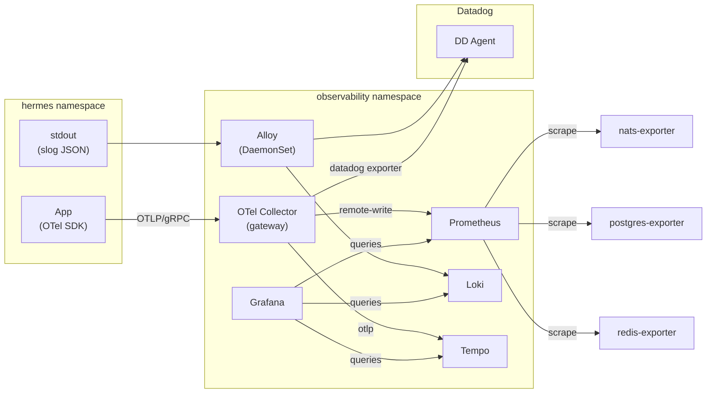

# Architecture

## Components

All in the `observability` namespace.

| Component | Chart | Mode | Purpose |
|---|---|---|---|
| **kube-prometheus-stack** | prometheus-community | single Prometheus (50Gi / 15d) | Metrics ingest + scrape; bundles Alertmanager (2 replicas), Grafana, node-exporter, kube-state-metrics |
| **Loki** | grafana | single-binary (100Gi / 14d) | Log storage |
| **Tempo** | grafana | single-binary (50Gi / 14d) | Trace storage |
| **OpenTelemetry Collector** | opentelemetry-helm-charts | Deployment (2 replicas) | OTLP gateway; fans out to Tempo, Prometheus, Datadog |
| **Grafana Alloy** | grafana | DaemonSet | Container stdout → Loki |
| **nats-exporter** | (plain YAML) | Deployment | NATS JetStream metrics |
| **postgres-exporter** | (plain YAML) | Deployment | Postgres pg_stat_* metrics |
| **redis-exporter** | (plain YAML) | Deployment | Redis INFO/CONFIG metrics |

## Data flow

## Why these choices (short version)

- **LGTM, not SigNoz:** larger ecosystem, modular components, Grafana familiarity from load tests. See [adr/001-lgtm-over-signoz.md](adr/001-lgtm-over-signoz.md).
- **OTel Collector as single fan-out point:** adding/removing a backend (including eventual Datadog removal) is a config change, not a code change. See [adr/002-otel-collector-fan-out.md](adr/002-otel-collector-fan-out.md).
- **Alloy, not OTel Logs SDK:** logs already go to stdout as slog JSON. Scraping is zero app code. See [adr/003-alloy-for-logs.md](adr/003-alloy-for-logs.md).
- **No DSM replacement:** Datadog's Data Streams Monitoring is proprietary — trace-based NATS latency is the substitute. See [adr/004-accepting-dsm-loss.md](adr/004-accepting-dsm-loss.md).
- **Alertmanager routing silent in Phase 1:** codify rules first, wire destinations after tuning. See [adr/005-silent-alertmanager-phase1.md](adr/005-silent-alertmanager-phase1.md).

## Relationship to the service tree

Services live in the `hermes` namespace; the observability stack lives in `observability`. The two communicate via in-cluster DNS:

- Apps export to `otel-collector-opentelemetry-collector.observability.svc:4317`.
- Prometheus scrapes cross-namespace by selecting `ServiceMonitor` resources labeled `app.kubernetes.io/part-of: hermes`, regardless of which namespace they live in.
- The Datadog Agent DaemonSet remains in `hermes` (unchanged) during Phase 1; Phase 2 removes it.

## Topology

- **Prometheus:** single instance. HA and long-term storage (Thanos/Mimir) are Phase 2.
- **Loki / Tempo:** single-binary mode. Filesystem storage on one PV each. Phase 2 swaps to S3 and enables HA.
- **Alertmanager:** 2 replicas even in Phase 1 — it's lightweight and critical-path. HA behavior (gossip) requires ≥2.
- **OTel Collector:** 2 replicas behind a ClusterIP Service. HPA is Phase 2 once we have real load numbers.
